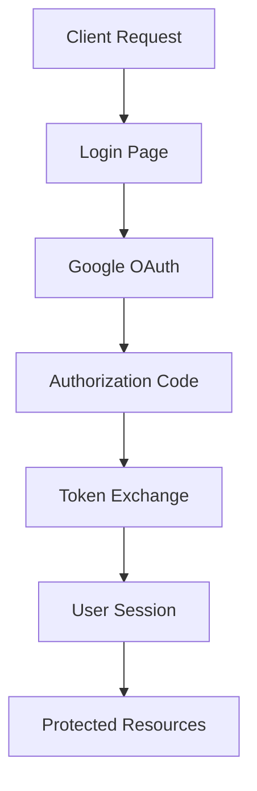
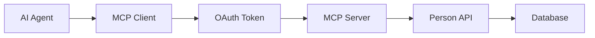

# OAuth 2.1 Secured Person Search App

## Overview

This is an enterprise-grade Person Search Application enhanced with OAuth 2.1 authentication using Auth.js (NextAuth v5). The application demonstrates comprehensive security implementation for both web application access and Model Context Protocol (MCP) server endpoints.

## 🔒 Security Features

### OAuth 2.1 Compliance
- **PKCE (Proof Key for Code Exchange)**: Enhanced security for authorization code flow
- **State Parameter**: CSRF protection during authorization
- **Secure Token Storage**: HTTP-only cookies with appropriate security flags
- **Token Validation**: Comprehensive Google token verification
- **Audience Validation**: Ensures tokens are intended for this application

### MCP Server Security
- **Bearer Token Authentication**: All MCP endpoints require valid OAuth tokens
- **Scope-based Authorization**: Fine-grained permissions for different operations
- **User Context Tracking**: All operations logged with authenticated user information
- **CORS Configuration**: Proper cross-origin resource sharing setup

## 🏗️ Architecture

### Authentication Flow


### MCP Integration


## 🔧 Environment Configuration

Create a `.env.local` file in the project root:

```env
# Google OAuth Configuration
GOOGLE_CLIENT_ID=your-google-client-id
GOOGLE_CLIENT_SECRET=your-google-client-secret

# NextAuth Configuration
NEXTAUTH_URL=http://localhost:3000
NEXTAUTH_SECRET=generated-secret-key

# Database (if using external database)
DATABASE_URL=your-database-connection-string
```

### Generate NextAuth Secret
```bash
npx auth secret
```

## 🚀 Installation & Setup

### 1. Install Dependencies
```bash
npm install
# or
pnpm install
```

### 2. Configure Google OAuth
1. Go to [Google Cloud Console](https://console.cloud.google.com)
2. Create a new project or select existing
3. Enable Google+ API
4. Create OAuth 2.0 credentials
5. Set authorized redirect URIs:
   - `http://localhost:3000/api/auth/callback/google` (development)
   - `https://your-domain.com/api/auth/callback/google` (production)

### 3. Database Setup
```bash
npx prisma generate
npx prisma db push
npx prisma db seed
```

### 4. Start Development Server
```bash
npm run dev
# or
pnpm dev
```

## 📡 API Endpoints

### OAuth 2.1 Endpoints

#### Discovery Endpoints
- `/.well-known/oauth-authorization-server` - Authorization server metadata
- `/.well-known/oauth-protected-resource` - Protected resource metadata

#### Authentication Endpoints
- `/api/auth/authorize` - OAuth authorization endpoint
- `/api/auth/token` - Token exchange endpoint  
- `/api/auth/callback/google` - Google OAuth callback
- `/api/auth/register` - Client registration (info only)

#### User Interface
- `/auth/login` - Login page
- `/auth/success` - Success page after authentication
- `/auth/error` - Error page for authentication failures

### MCP Server Endpoints

#### Server Information
```http
GET /api/mcp
```
Returns server capabilities and authentication requirements.

#### MCP Protocol
```http
POST /api/mcp
Authorization: Bearer <oauth-token>
Content-Type: application/json

{
  "jsonrpc": "2.0",
  "id": 1,
  "method": "tools/call",
  "params": {
    "name": "search_users",
    "arguments": {
      "query": "john"
    }
  }
}
```

### Protected Person API
- `GET /api/people` - List all persons (requires authentication)
- `POST /api/people` - Create person (requires authentication)
- `PUT /api/people/:id` - Update person (requires authentication)
- `DELETE /api/people/:id` - Delete person (requires authentication)

## 🛠️ MCP Tools

The server provides the following authenticated MCP tools:

### 1. search_users
Search for users by name, email, or phone number.
```json
{
  "name": "search_users",
  "arguments": {
    "query": "search term"
  }
}
```

### 2. get_user_by_id
Retrieve a specific user by ID.
```json
{
  "name": "get_user_by_id", 
  "arguments": {
    "id": "user-id"
  }
}
```

### 3. add_user
Create a new user.
```json
{
  "name": "add_user",
  "arguments": {
    "name": "John Doe",
    "email": "john@example.com", 
    "phoneNumber": "+1234567890"
  }
}
```

### 4. update_user
Update an existing user.
```json
{
  "name": "update_user",
  "arguments": {
    "id": "user-id",
    "name": "Updated Name",
    "email": "updated@example.com"
  }
}
```

### 5. delete_user
Delete a user by ID.
```json
{
  "name": "delete_user",
  "arguments": {
    "id": "user-id"
  }
}
```

## 🔐 OAuth Scopes

The application uses the following OAuth scopes:

- `openid` - OpenID Connect authentication
- `profile` - Basic profile information
- `email` - Email address access
- `read:mcp` - Read access to MCP resources
- `write:mcp` - Write access to MCP resources  
- `persons:read` - Read access to person data
- `persons:write` - Write access to person data

## 🧪 Testing the MCP Server

### 1. Using VS Code MCP Extension
Add to your MCP configuration:
```json
{
  "servers": {
    "person-search": {
      "type": "http",
      "url": "http://localhost:3000/api/mcp"
    }
  }
}
```

### 2. Using Claude Desktop
Add to your MCP configuration:
```json
{
  "mcpServers": {
    "person-search": {
      "command": "npx",
      "args": [
        "-y", 
        "mcp-remote",
        "http://localhost:3000/api/mcp"
      ]
    }
  }
}
```

### 3. Manual Testing with curl
First, get an OAuth token:
```bash
# 1. Visit the login page
open http://localhost:3000/auth/login

# 2. Complete OAuth flow and extract token from browser
# 3. Use token in API calls
curl -H "Authorization: Bearer YOUR_TOKEN" \
     -H "Content-Type: application/json" \
     -d '{"jsonrpc":"2.0","id":1,"method":"tools/list"}' \
     http://localhost:3000/api/mcp
```

## 📦 Production Deployment

### Vercel Deployment

1. **Environment Variables**: Add to Vercel dashboard
   ```
   GOOGLE_CLIENT_ID=your-production-client-id
   GOOGLE_CLIENT_SECRET=your-production-client-secret
   NEXTAUTH_URL=https://your-domain.vercel.app
   NEXTAUTH_SECRET=your-generated-secret
   ```

2. **Google OAuth Setup**: Update redirect URIs
   ```
   https://your-domain.vercel.app/api/auth/callback/google
   ```

3. **Deploy**:
   ```bash
   vercel deploy --prod
   ```

### Docker Deployment

```dockerfile
# Dockerfile example
FROM node:18-alpine

WORKDIR /app
COPY package*.json ./
RUN npm install
COPY . .
RUN npm run build

EXPOSE 3000
CMD ["npm", "start"]
```

## 📊 Monitoring & Logging

The application includes comprehensive logging for:

- **Authentication Events**: Login attempts, token validation, failures
- **MCP Operations**: Tool calls, user context, operation results  
- **API Access**: Request patterns, error rates, performance metrics
- **Security Events**: Invalid tokens, unauthorized access attempts

Example log output:
```
🔐 OAuth Authorization Request: { client_id: "1234567890...", scope: "openid profile email" }
✅ OAuth Token Exchange Success: { token_type: "Bearer", expires_in: 3600 }  
🔧 MCP Request: { method: "tools/call", authenticated: true, toolName: "search_users" }
✅ MCP Tool Success: { tool: "search_users", user: "john@example.com", resultLength: 156 }
```

## 🛡️ Security Best Practices

### Token Security
- Tokens stored in HTTP-only cookies
- Secure flag enabled in production
- SameSite protection against CSRF
- Automatic token expiration

### CORS Configuration
- Restrictive CORS policies
- Environment-specific origins
- Proper preflight handling
- Credentials included where appropriate

### Error Handling
- No sensitive information in error messages
- Proper OAuth 2.1 error formatting
- User-friendly error pages
- Security event logging

## 📚 Additional Resources

- [OAuth 2.1 Specification](https://tools.ietf.org/html/draft-ietf-oauth-v2-1)
- [Model Context Protocol](https://github.com/anthropics/mcp)
- [NextAuth.js Documentation](https://next-auth.js.org/)
- [Google OAuth 2.0 Guide](https://developers.google.com/identity/protocols/oauth2)

## 🤝 Contributing

1. Fork the repository
2. Create a feature branch
3. Implement changes with tests
4. Submit a pull request
5. Ensure all security reviews pass

## 📄 License

MIT License - see LICENSE file for details.

---

**🔒 Enterprise Security Implementation Complete**

This application demonstrates production-ready OAuth 2.1 authentication with comprehensive MCP server protection, suitable for enterprise environments requiring secure AI agent integration.